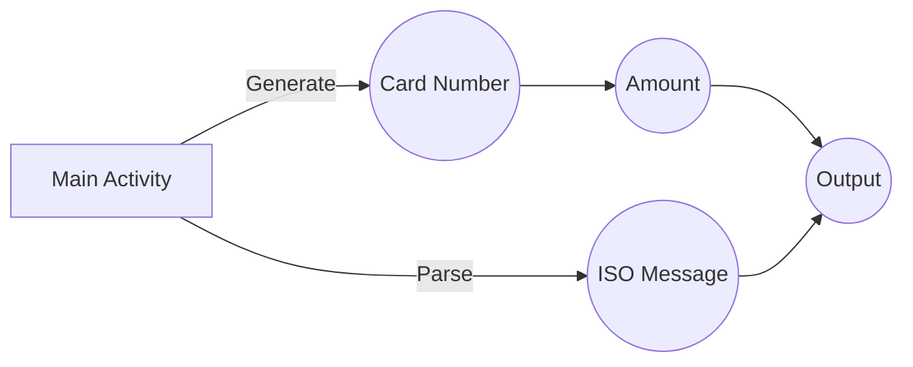

# About Me

Hi! I'm Morvarid Estanesti. I'm an Android Developer who is familiar with Java and Kotlin Android programming. I love to improve my skills in a daily manner. I use XML ViewSystem, Jetpack Compose, ViewModels and almost any tools those are available in Android Ecosystem. I like to follow principles like SOLID, DRY, KISS, YAGNI etc. and design patterns like MVC, MVP, MVVM, Repository, Factory, Abstract Factory, Facade, etc.

# ISO Generator and Parser
This is a task given to me as a part of employment process. Its about to work with ISO8583 standard and its main features are :
* Message Builder :
  * User enters **card Number** and **amount**
  * Application creates 4 fields of ISO8583
  * Displays the fully generated ISO8583 message
* Message Parser :
  * User enters an ISO8583 message
  * Application parses the message
  * Displays the extracted fields

# Technical Information
* Uses **net.sf.j8583:j8583** library as a standard ISO Builder
* Does not utilize manual methods like string concatenation, substring or manual parsing to generate and/or parse ISO8583 messages
* Uses ViewBinding


# Files

The project structure is as follows:
```
AndroidManifest.xml (Application Manifest)
[assets]
  fields.xml (ISO8583 Fields Definition XML file)
[java]
  [adapters]
    [callbacks]
      CodecCallback.kt (RecyclerView Adapter Callback)
    AdapterRecyclerIso.kt (RecyclerView Adapter)
  [com.estanesti.isogen]
    App.kt (Main Application)
    MainActivity.kt (Main Activity)
  [helpers]
    IsoHelper.kt (The main helper class to generate/parse ISO8583 messages)
  [models]
    Codec.kt (Data class to hold Coded and Decoded messages)
  [viewmodels]
    ModeViewModel.kt (ViewModel used to switch application mode [GENERATE/PARSE])
[res]
  [drawable]
    ic_copy.xml (Copy Icon)
    ic_launcher_background.xml (Launcher Background Image)
    ic_launcher_foreground.xml (Launcher Forground Image)
  [layout]
    activity_main.xml (Main Activity Layout)
    adapter_recycler_iso.xml (ISO Message RecyclerView Adapter Layout)
  [mipmap-anydpi]
    ic_launcher.xml (Launcher Icon)
    ic_launcher_round.xml (Rounded Launcher Icon)
  [mipmap-hdpi]
    ic_launcher.webp (Launcher Icon Image)
    ic_launcher_round.webp (Rounded Launcher Icon Image)
  [mipmap-mdpi]
    ic_launcher.webp (Launcher Icon Image)
    ic_launcher_round.webp (Rounded Launcher Icon Image)
  [mipmap-xhdpi]
    ic_launcher.webp (Launcher Icon Image)
    ic_launcher_round.webp (Rounded Launcher Icon Image)
  [mipmap-xxhdpi]
    ic_launcher.webp (Launcher Icon Image)
    ic_launcher_round.webp (Rounded Launcher Icon Image)
  [mipmap-xxxhdpi]
    ic_launcher.webp (Launcher Icon Image)
    ic_launcher_round.webp (Rounded Launcher Icon Image)
  [values]
    colors.xml (Colors used in application)
    strings.xml (String messages used in application)
    themes.xml (Themes defined and used in application)
  [xml]
    backup_rules.xml (Backup Rules)
    data_extraction_rules.xml (Data Extraction Rules)
```

# Installation Steps
* Open the project in Android Studio
* Synchronize gradle
* Build and run the application in Emulator or real device

# Run APK
There is also an APK file in releases that is build in release mode. The file is minified using ProGuard and is installable directly to your devices.
* Copy the file to your device.
* Install it using your Package Installer.
> You can also install it using `adb install ./release/app-release.apk` command in your terminal.

## WorkFlow

When application launches:


